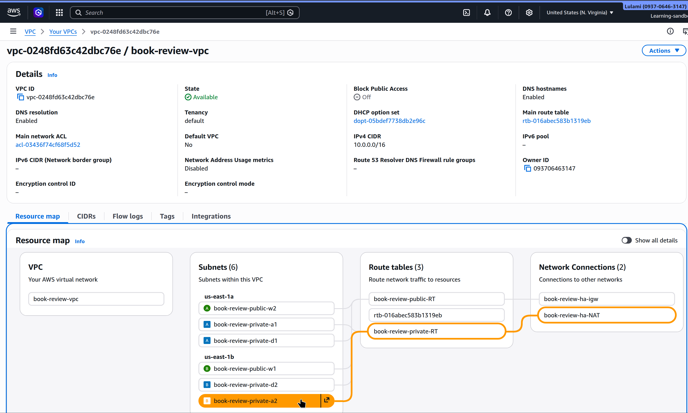
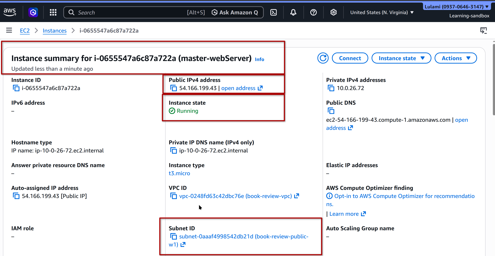
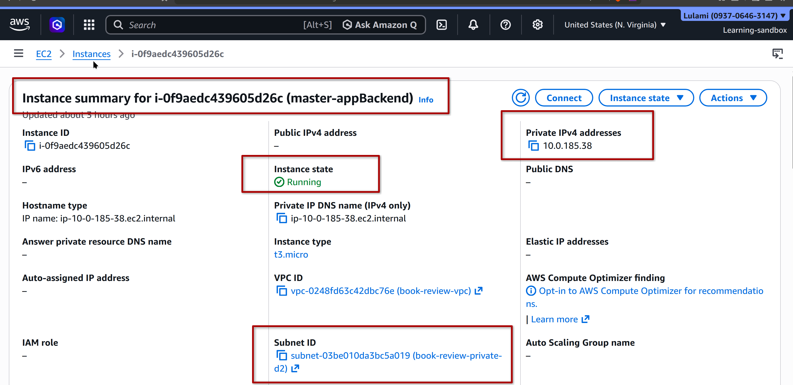
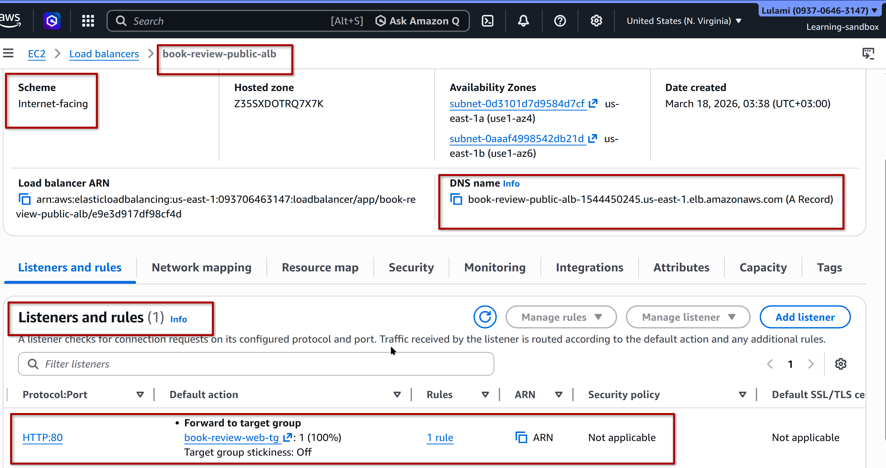
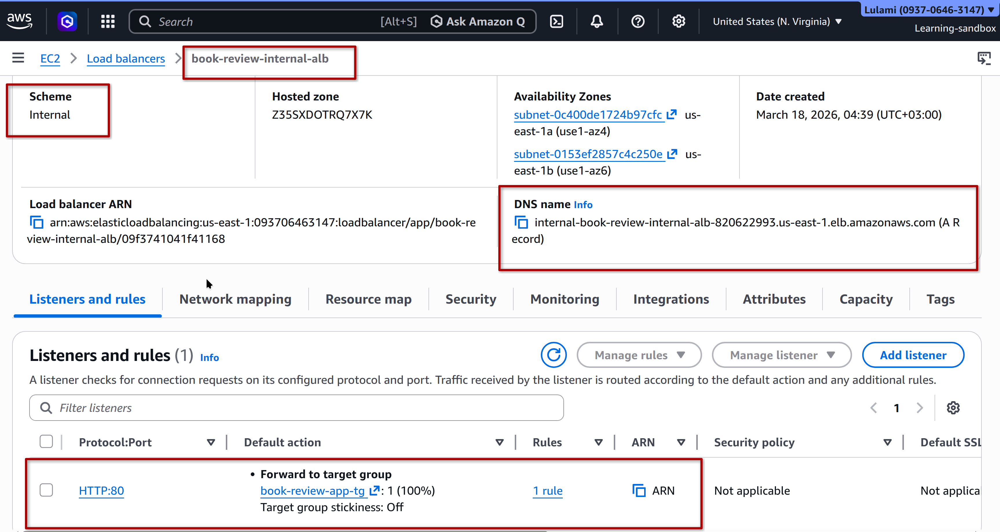
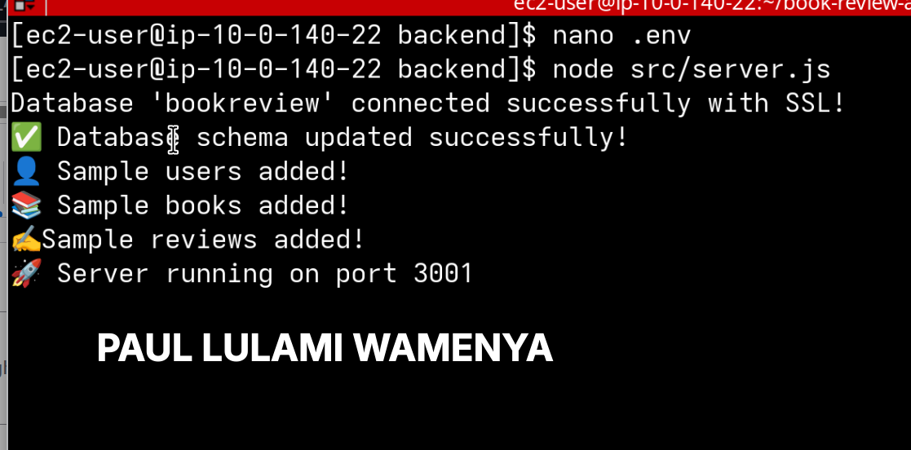

# 📸 Capstone A4 – Deployment Proof

---

## 🌐 VPC Architecture

✔ Custom VPC with CIDR block  
✔ Public and private subnets across multiple AZs  
✔ NAT Gateway for private subnet internet access  
✔ Route tables properly configured  

---

## 🖥️ EC2 Instances (Web & Backend)

### Web Server (Public Subnet)

### Backend Server (Private Subnet)

✔ Separation of concerns (web vs backend)  
✔ Private subnet isolation for backend  
✔ Secure internal communication  

---

## ⚖️ Load Balancers (ALB)

### Public ALB (Internet-facing)

### Internal ALB (Private)

✔ Public ALB routes external traffic  
✔ Internal ALB handles backend communication  
✔ Listener rules correctly configured  

---

## 🛢️ RDS Database (Multi-AZ)

✔ Multi-AZ enabled for high availability  
✔ Private subnet deployment  
✔ Secure connection from backend  

---

## 🚀 Application Deployment

### Application Access (via ALB)

### Backend Connected to Database

✔ End-to-end connectivity verified  
✔ User registration successful  
✔ Backend successfully connected to RDS  

---

## 🎯 Target Group & Auto Scaling Group (ASG)

⚠️ Note:

The Target Group and Auto Scaling Group (ASG) were successfully configured and tested during deployment.  
However, the resources were later terminated as part of cost optimization and environment cleanup.

### ✔ What was implemented:

- Target Group attached to Application Load Balancer  
- Health checks configured and verified  
- EC2 instances registered automatically via ASG  
- Traffic successfully routed from ALB → Target Group → Instances  

### ✔ Validation performed:

- Application accessible via Load Balancer DNS  
- Instances passed health checks  
- Traffic routing confirmed  

### 🧠 Engineering Note:

This reflects real-world cloud practice where non-production environments are decommissioned after validation to control costs.
